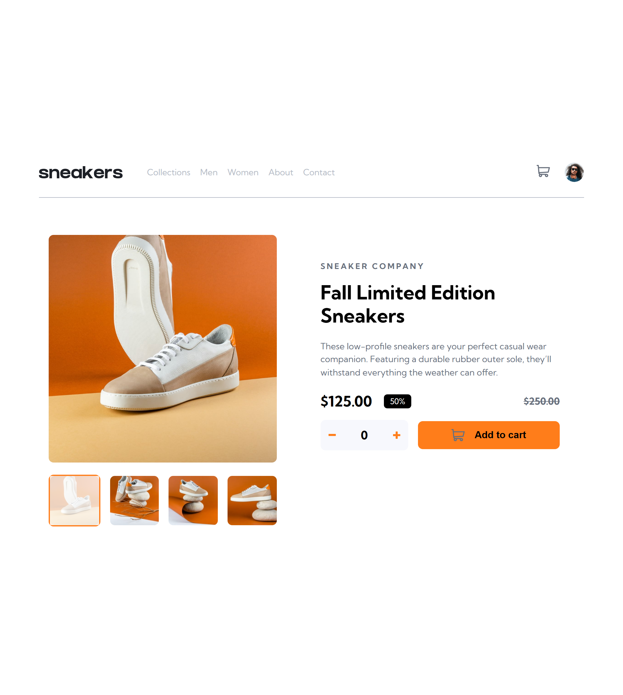
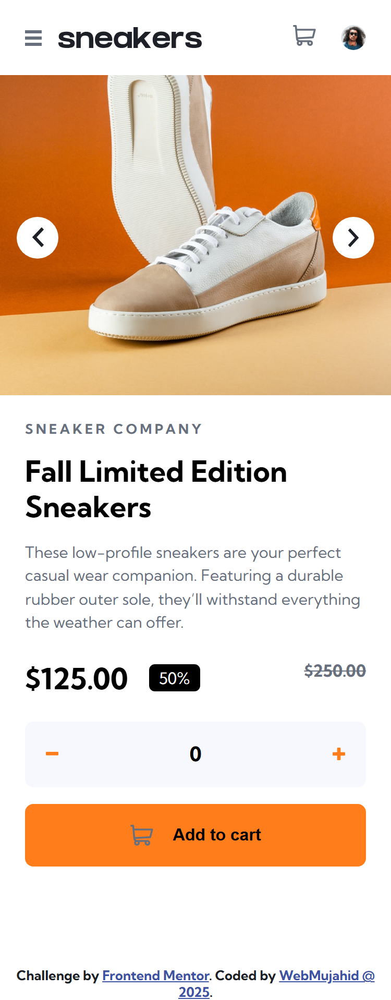

# Frontend Mentor - E-commerce product page solution

This is a solution to the [E-commerce product page challenge on Frontend Mentor](https://www.frontendmentor.io/challenges/ecommerce-product-page-UPsZ9MJp6). Frontend Mentor challenges help you improve your coding skills by building realistic projects.

## Table of contents

- [Overview](#overview)

  - [The challenge](#the-challenge)
  - [Screenshot](#screenshot)
  - [Links](#links)

- [My process](#my-process)

  - [Built with](#built-with)
  - [What I learned](#what-i-learned)
  - [Continued development](#continued-development)
  - [Useful resources](#useful-resources)

- [Author](#author)
- [Acknowledgments](#acknowledgments)

## Overview

### The challenge

Users should be able to:

- View the optimal layout for the site depending on their device's screen size
- See hover states for all interactive elements on the page
- Open a lightbox gallery by clicking on the large product image
- Switch the large product image by clicking on the small thumbnail images
- Navigate product images using next and previous buttons
- Add items to the cart
- View the cart and remove items from it

### Screenshot




### Links

- Solution URL: [Add solution URL here](https://your-solution-url.com)
- Live Site URL: [Add live site URL here](https://your-live-site-url.com)

## My process

### Built with

- Semantic **HTML5** markup
- **SCSS** (with mixins and variables)
- **Flexbox**
- **CSS Grid**
- **Mobile-first workflow**
- [**React**](https://reactjs.org/) – JS library for UI
- React **hooks** (`useState`) for state management

### What I learned

This project helped me strengthen my React and SCSS workflow.

Some key takeaways:

1. Managing state with `useState` to handle cart updates and image navigation.
2. Building a **lightbox modal** with thumbnails, next/previous navigation, and an overlay.
3. Styling hover and active states for thumbnails using SCSS pseudo-elements.

Example: **thumbnail hover and active states**

```scss
.thumbnail:hover::after {
  content: "";
  position: absolute;
  inset: 0;
  background-color: rgba(255, 255, 255, 0.5);
}

.active-thumb {
  border: 2px solid $Orange;

  &::after {
    content: "";
    position: absolute;
    inset: 0;
    background-color: rgba(255, 255, 255, 0.75);
  }
}
```

Example: **using `useState` for image navigation**

```jsx
const [currentImage, setCurrentImage] = useState(0);

const handleNextImage = () => {
  setCurrentImage((prev) => (prev === productImages.length - 1 ? 0 : prev + 1));
};

const handlePrevImage = () => {
  setCurrentImage((prev) => (prev === 0 ? productImages.length - 1 : prev - 1));
};
```

### Continued development

- Improve **accessibility** (keyboard navigation, ARIA attributes for modal/lightbox).
- Add **animations** for image transitions in the lightbox.
- Explore **global state management** (e.g., React Context) for cart instead of prop drilling.
- Convert styles into **CSS Modules** or **Styled Components** for better component encapsulation.

### Useful resources

- [React Docs – useState](https://react.dev/reference/react/useState) – Helpful for managing state.
- [CSS Tricks – Flexbox Guide](https://css-tricks.com/snippets/css/a-guide-to-flexbox/) – Quick reference for layouts.
- [MDN – position: fixed](https://developer.mozilla.org/en-US/docs/Web/CSS/position) – Useful when creating the lightbox modal.

## Author

- Frontend Mentor – [@Abdulgafar-Riro](https://www.frontendmentor.io/profile/Abdulgafar-Riro)
- Twitter – [@milo4888](https://www.twitter.com/milo4888)

## Acknowledgments

Thanks to **Frontend Mentor** for the challenge and the community for feedback. 🚀
